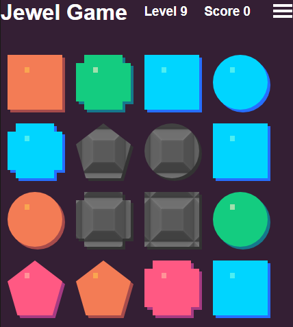

# JewelGame




HTML 5, CSS 3, and Javascript matching game.
You can see a working version of the app at [https://medicationforall.github.io/JewelGame](https://medicationforall.github.io/JewelGame)

## Requirements
http web server. Apache, python, or IIS will work fine.

### Python quick webserver
Requires python to be installed.
1. Open a command prompt in the directory where you have JewelGame downloaded.
2. In the command prompt type the following:
```
python -m http.server
```
3. Open a web browser and in the address bar go to **http://localhost:8000**

## Libraries
This Application uses:
* [jQuery](https://jquery.com/)
* [Animate.css](https://daneden.github.io/animate.css/)
* [seedrandom.js](https://github.com/davidbau/seedrandom)
* [Game-icons.net](http://game-icons.net/)
* [Store.js](https://github.com/marcuswestin/store.js)


All of the scripts are being called via cdn.<br />
If you want to run this application offline you'll need to locally reference those libraries.


## License
This application is Licensed under LGPL see the [license file](LICENSE).
