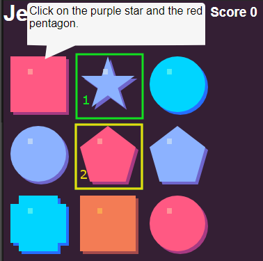
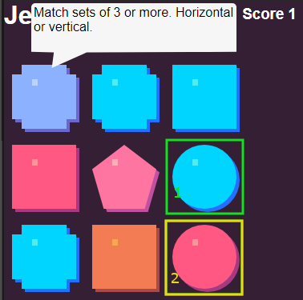
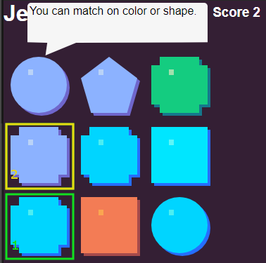
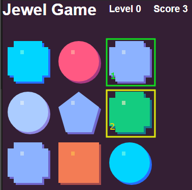
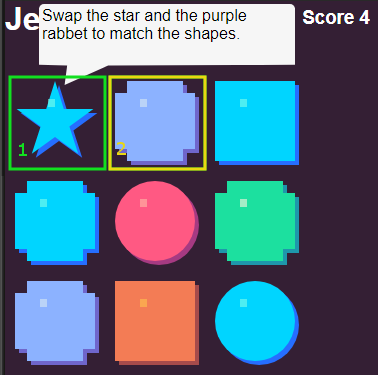
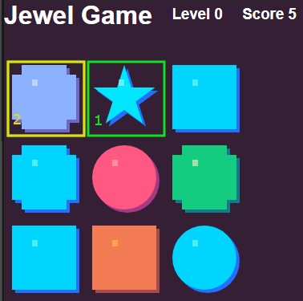
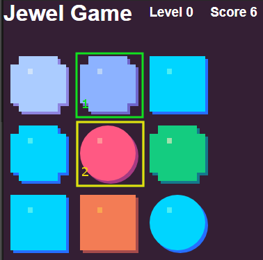
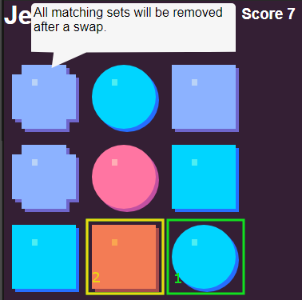
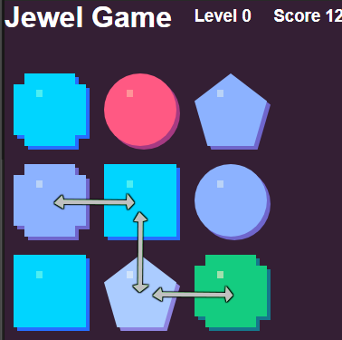

# Level 1 - Tutorial suggested walkthrough.

1. Click on the purple star.
* Click on the center Red pentagon.
* This will cause center row to have 3 purple shapes, and remove the set.

1. Click on the blue circle.
* Click on the red circle.
* This will cause center row to have 3 red shapes, and remove the set.

1. Click on the lower left blue rabbet.
* Click on the purple rabbet.
* This will cause center row to have 3 blue shapes, and remove the set.

1. Click on the upper right purple rabbet.
* Click on the green rabbet.
* This will cause center row to have 3 purple shapes, and remove the set.

1. Click on the blue star.
* Click on the purple rabbet.
* This will cause left column to have 3 rabbet shapes, and remove the set.

1. Click on the blue star.
* Click on the purple rabbet.
* This will cause left column to have 3 blue shapes, and remove the set.

1. Click on the purple rabbet.
* Click on the red circle.
* This will cause center row to have 3 rabbet shapes, and remove the set.

1. Click on the blue circle.
* Click on the orange square.
* This will cause center column to have 3 circle shapes. The right column to have 3 square shapes, and will remove both sets.

Last move of the board you can swap any of the following:
* The purple rabbet and the blue square.
* The blue square and the purple pentagon.
* the purple pentagon and the green rabbet.

*Note* this isn't the only possible route to play the Tutorial stage. There is at least 1 other path that allows you to get a higher score than the path suggested. Good Luck!
